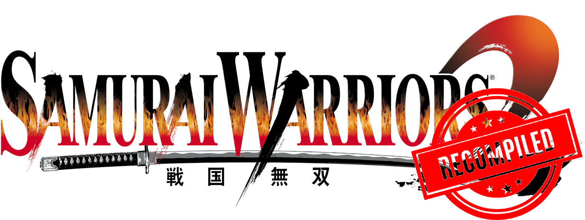

# Samurai Warriors 2 — ReXGlue

Windows AMD64 recompilation project for **Samurai Warriors 2 (USA, Europe)** using ReXGlue SDK **0.10.0**. The current configuration builds the game with **Title Update #3** and the **Samurai Warriors 2: Xtreme Legends** module.

The original ReXGlue SDK binaries are unchanged. Project-specific fixes, diagnostics, and content setup live in this repository. Extracted game files are used as build and runtime inputs.

## Requirements

- ReXGlue SDK 0.10.0 for Windows AMD64
- Visual Studio 2026 Community with the C++ toolchain
- LLVM/Clang, CMake 3.25 or newer, and Ninja
- An extracted USA/Europe copy of Samurai Warriors 2
- The matching Title Update #3 files
- A legally obtained Samurai Warriors 2 XL content package

Expected layout:

```text
rexglue-sdk-win-amd64/
├── bin/
├── include/
├── lib/
├── Samurai Warriors 2 (USA, Europe)/
│   ├── default.xex
│   ├── SW2XL_US.dll
│   └── Samurai Warriors 2 Title Update #3/
│       ├── default.xex
│       └── default.xexp
└── sw2-recomp/
```

`build.ps1` expects Visual Studio at `C:\Program Files\Microsoft Visual Studio\18\Community`. Adjust `$vsRoot` in that script if Visual Studio is installed elsewhere.

## Build and run

From the SDK root:

```powershell
.\sw2-recomp\build.ps1
.\sw2-recomp\run.ps1
```

The Release executable is written to `sw2-recomp/out/build/win-amd64-release/samurai_warriors_2.exe`.

The manifest points to the `default.xex` stored beside `default.xexp`. ReXGlue therefore applies Title Update #3 during code generation, making the generated code correspond to version **0.0.3.3**. The original root-level `default.xex` remains unchanged.

`SW2XL_US.dll` is compiled as a separate module named `samurai_warriors_2_SW2XL_US.dll`. Additional function boundaries found during analysis are stored in `sw2xl_us_config.toml`.

The launcher defaults to windowed mode, XInput, keyboard emulation, `warn` logging, and local data directories. Explicit options override those defaults:

```powershell
.\sw2-recomp\run.ps1 --fullscreen
.\sw2-recomp\run.ps1 --input_backend sdl --no-mnk_mode
.\sw2-recomp\run.ps1 --log_level info
```

Boolean options use flags such as `--fullscreen` and `--no-fullscreen`.

## Controller and keyboard input

Keyboard and mouse controller emulation is enabled through `--mnk_mode` and is combined with the physical XInput controller for player one.

| Xbox 360 input | Default keyboard or mouse input |
| --- | --- |
| Left stick | W, A, S, D |
| A | Space |
| B | C |
| X | E |
| Y | F |
| LB / RB | Q / R |
| LT / RT | Right / left mouse button |
| D-pad | Arrow keys |
| Start / Back | Enter / Tab |
| Left / right stick press | Shift / middle mouse button |
| Right stick | Mouse movement |

The window must have focus for keyboard input. Bindings can be changed at launch:

```powershell
.\sw2-recomp\run.ps1 --keybind_b V --keybind_left_shoulder Z
```

## Saves, profiles, DLC, and cache locations

Runtime data is kept outside OneDrive by default:

| Data | Default location |
| --- | --- |
| Saves, profiles, and installed content | `sw2-recomp/userdata` |
| Shader cache | `sw2-recomp/cache` |

Both directories are excluded from Git. Custom locations can be selected at launch:

```powershell
.\sw2-recomp\run.ps1 `
  --user_data_root 'D:\Games\SW2\userdata' `
  --cache_root 'D:\Games\SW2\cache'
```

## Install Xtreme Legends content

The installer searches `D:\Samurai Warriors 2 XL` by default:

```powershell
.\sw2-recomp\install-dlc.ps1
```

To select another source directory:

```powershell
.\sw2-recomp\install-dlc.ps1 -DlcRoot 'D:\Other Folder\Samurai Warriors 2 XL'
```

The installer scans for `LIVE`, `PIRS`, and `CON` STFS containers and installs them through ReXGlue's content manager. Installed packages remain under the configured user-data directory, and the original source packages are not modified.

## Project changes

### Graphics plugin deployment

`CMakeLists.txt` calls `rexglue_setup_target(... GPU_PLUGINS xenos)` so the Xenos plugin and its dependencies are placed beside the executable.

### Resolved: crash shortly after entering a stage

The original recompilation could close roughly five seconds after entering a stage, regardless of the selected character. Investigation traced the crash to repeated audio cleanup caused by an event-state mismatch.

The game clears an event by resetting its guest-memory `SignalState`, while ReXGlue also tracks a host event. A hook at `0x82349714` calls `sw2_clear_host_event` after the original instruction to synchronize both states. The implementation is in `src/event_fix.cpp` and preserves the game's original instructions.

The standalone test in `tests/event_reset_test.cpp` reproduces the state mismatch, verifies `Clear()`, and exercises repeated signal-and-clear cycles. Playtesting of the base-game recompilation confirmed that the early-stage crash no longer occurred. The fix remains enabled in the Title Update and XL configuration; this statement does not claim separate SW2XL gameplay validation.

### Optional diagnostics

Heap and input diagnostics are disabled by default. They can be enabled for a diagnostic run:

```powershell
$env:SW2_HEAP_DIAGNOSTICS = '1'
$env:SW2_INPUT_DIAGNOSTICS = '1'
.\sw2-recomp\run.ps1 --log_level info
```

Remove the variables before a normal launch:

```powershell
Remove-Item Env:SW2_HEAP_DIAGNOSTICS -ErrorAction SilentlyContinue
Remove-Item Env:SW2_INPUT_DIAGNOSTICS -ErrorAction SilentlyContinue
```

These tools collect diagnostic information. They do not remap, buffer, inject, or otherwise change controller input.

## Main files

| File or directory | Purpose |
| --- | --- |
| `CMakeLists.txt` | Executable sources, Xenos deployment, and linker maps |
| `CMakePresets.json` | Windows AMD64 build presets |
| `samurai_warriors_2_manifest.toml` | Game, Title Update, and XL module inputs |
| `samurai_warriors_2_config.toml` | Base executable functions and hooks |
| `sw2xl_us_config.toml` | XL module function configuration |
| `build.ps1` | Release build launcher |
| `run.ps1` | Game launcher and local runtime-data defaults |
| `install-dlc.ps1` | STFS content importer |
| `src/event_fix.cpp` | Host and guest event synchronization |
| `src/dlc_installer.cpp` | Runtime DLC installation |
| `src/heap_diagnostics.cpp` | Optional heap diagnostics |
| `src/input_diagnostics.cpp` | Optional controller polling diagnostics |
| `generated/` | ReXGlue-generated source |
| `out/` | Local builds, dependencies, maps, and logs |

Further technical notes are available in [crash-investigation.md](crash-investigation.md).
